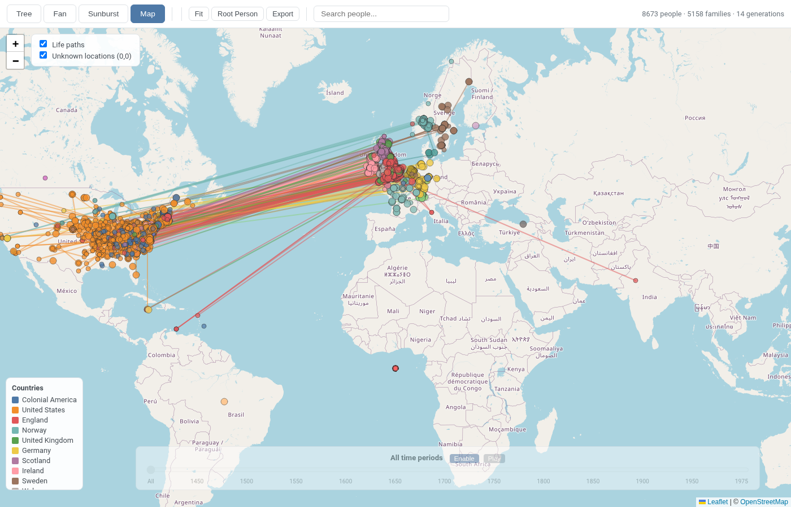
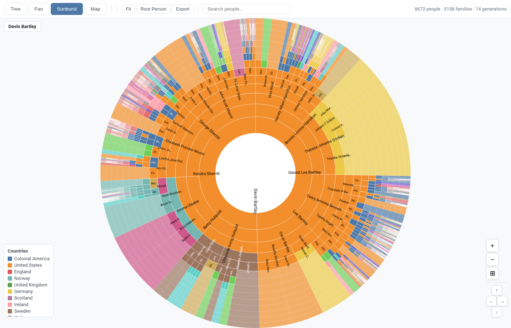

# Family Tree Visualizer

**Drag and drop a GEDCOM file. Watch your entire family history come to life.**

No account. No upload. No server. Your data stays on your device — open `index.html`, drop in your `.ged` file, and instantly explore thousands of ancestors across interactive maps, charts, and diagrams.

**Live demo:** [devinbartley.com/familytree](https://devinbartley.com/familytree/)

---

## See Your Ancestors on the Map

Drop in your GEDCOM and the app automatically geocodes every birthplace, death location, and life event — plotting them across an interactive world map with color-coded country origins. Use the time slider function to view locations and migration patterns over time. 



*8,673 people · 5,158 families · 14 generations — geocoded and mapped automatically*

---

## Explore 14 Generations at a Glance

The sunburst view renders your entire lineage as a single interactive diagram. Each ring is a generation. Each segment is a person. Click any segment to navigate to them.




---

## Features

- **Drag & drop GEDCOM** — works with any `.ged` or `.gedcom` file from any genealogy software
- **Auto-geocoding** — resolves place names (including historical regions like "County Mayo" and "Württemberg") to map coordinates with a local cache
- **4 interactive views** — Map, Sunburst, Tree, Fan
- **100+ generation support** — handles large, deep family trees with thousands of people
- **Search** — find any person instantly by name
- **Export** — save high-resolution images of any view
- **Zero dependencies** — no build step, no framework, no account required
- **Your data stays local** — nothing is uploaded anywhere

---

## Quick Start

```bash
git clone https://github.com/yourusername/familytreevisualizer
cd familytreevisualizer

# Serve locally (required for file loading)
python3 -m http.server 8080
```

Open `http://localhost:8080` — then drag your `.ged` file onto the page.

> **No Python?** Any local server works: `npx serve .`, `php -S localhost:8080`, or the VS Code Live Server extension.

---

## Views

| View | Best For |
|------|----------|
| **Tree** | Navigating direct ancestor/descendant lines |
| **Fan** | Seeing the breadth of your ancestry at once |
| **Sunburst** | Exploring full generational depth interactively |
| **Map** | Discovering where your family came from geographically |

---

## Project Structure

```
familytreevisualizer/
  index.html              # Single-page app — no build step
  css/styles.css          # All styles
  js/
    app.js                # Main controller — state, view switching, data loading
    gedcom-parser.js      # GEDCOM 5.5.1 / 7.0 parser
    tree-view.js          # Pedigree tree renderer (SVG)
    fan-view.js           # Fan chart renderer (SVG)
    sunburst-view.js      # Sunburst diagram renderer (SVG)
    map-view.js           # Leaflet map with geocoded markers
    geocoder.js           # Place name → lat/lng with local cache
    export.js             # High-res image export
  data/
    tree.ged              # Optional: default GEDCOM (auto-loads on startup)
    geocache.json         # Cached geocoding results
  assets/screenshots/     # README screenshots
  tests/                  # Unit tests for geocoder and data pipeline
  deploy.sh               # nginx deploy script (self-hosting)
```

---

## Deployment

To self-host on nginx with HTTPS:

```bash
sudo bash deploy.sh
```

Edit `DOMAIN` and `DOC_ROOT` at the top of `deploy.sh` for your server. The script copies all app files, sets permissions, and reloads nginx.

To place a default GEDCOM that auto-loads for visitors:
```bash
sudo cp your-file.ged /var/www/html/yourdomain.com/familytree/data/tree.ged
```

---

## Tech Stack

| | |
|--|--|
| **Rendering** | Vanilla JS + native SVG — no framework |
| **Maps** | [Leaflet](https://leafletjs.com/) (CDN) |
| **Geocoding** | [Nominatim / OpenStreetMap](https://nominatim.org/) — free, no API key |
| **GEDCOM** | Custom parser supporting 5.5.1 and 7.0 |

---

## License

MIT License

Copyright (c) 2026 Devin Bartley

Permission is hereby granted, free of charge, to any person obtaining a copy
of this software and associated documentation files (the "Software"), to deal
in the Software without restriction, including without limitation the rights
to use, copy, modify, merge, publish, distribute, sublicense, and/or sell
copies of the Software, and to permit persons to whom the Software is
furnished to do so, subject to the following conditions:

The above copyright notice and this permission notice shall be included in all
copies or substantial portions of the Software.

THE SOFTWARE IS PROVIDED "AS IS", WITHOUT WARRANTY OF ANY KIND, EXPRESS OR
IMPLIED, INCLUDING BUT NOT LIMITED TO THE WARRANTIES OF MERCHANTABILITY,
FITNESS FOR A PARTICULAR PURPOSE AND NONINFRINGEMENT. IN NO EVENT SHALL THE
AUTHORS OR COPYRIGHT HOLDERS BE LIABLE FOR ANY CLAIM, DAMAGES OR OTHER
LIABILITY, WHETHER IN AN ACTION OF CONTRACT, TORT OR OTHERWISE, ARISING FROM,
OUT OF OR IN CONNECTION WITH THE SOFTWARE OR THE USE OR OTHER DEALINGS IN THE
SOFTWARE.

---

## Credits

**Author:** Devin Bartley
**Built with prompt engineering assistance from** [Claude Code](https://claude.ai/code) (Anthropic)
